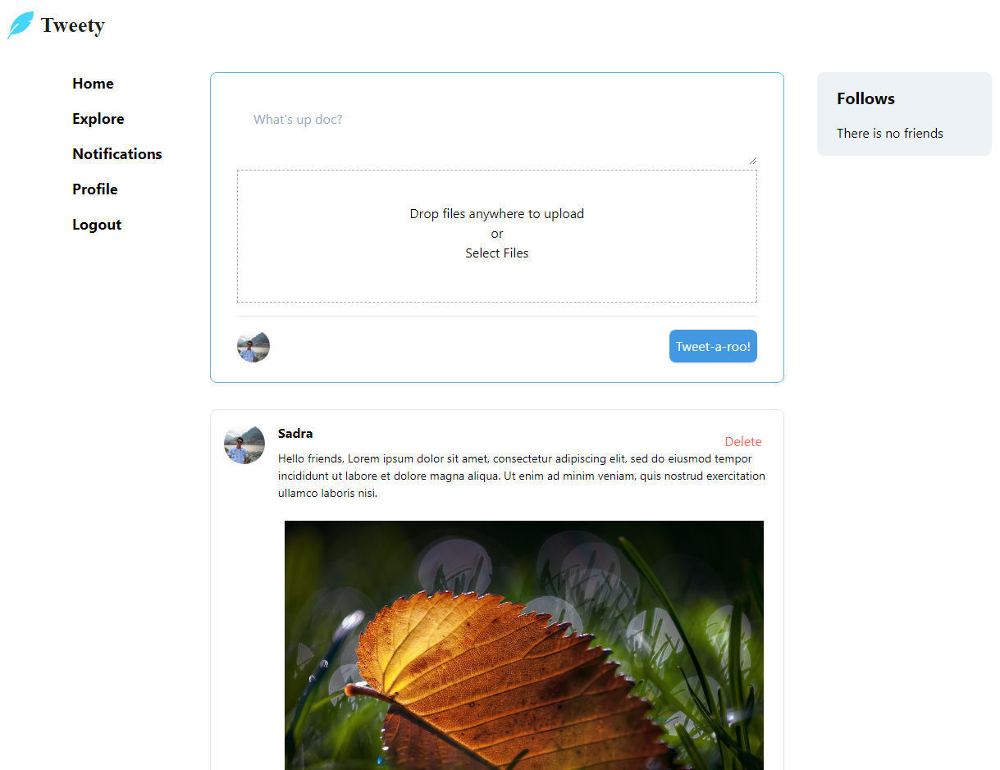

## Tweety

Tweety is a social media very similar to Twitter. You can create a profile and post some tweets. Tweets have like/dislike
feature. Also, you can use the explorer tab in order to see other users' account. If you want, you can follow them, and then
you can see their tweets on your timeline.

In addition, you can edit your profile like changing you profile picture or your cover and also write a description about yourself.

## Installation
First you should clone this project using the below command.

`git clone https://github.com/sadrahkm/Tweety.git`

Then you must install all the dependencies of the project.

`composer install`

It's done! You can use the following command to bring up your project on localhost:8000 (default).

`php artisan serve`

## Laracasts
I've done this project beside the [laracasts course](https://laracasts.com/series/laravel-6-from-scratch). You can use
this amazing source to level up your skills.

